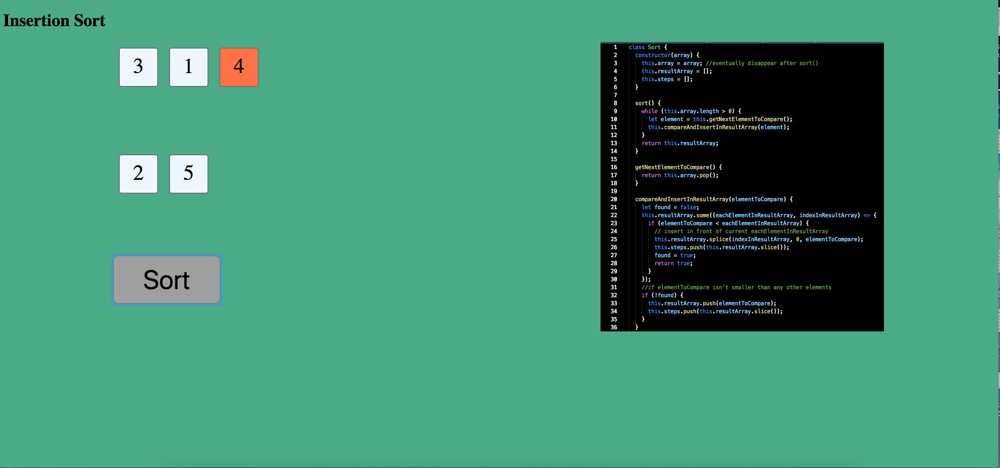

# Visualize Sorting Algorithms
### This was created during my time as a [Code Chrysalis](https://codechrysalis.io) Student



This project was created during my time at Code Chrysalis. 

A front-end visualization of the sorting algorithm

### Global Requirements

* node
* npm
* yarn

### Installing Dependencies and Set Up

To install dependencies:

```bash
$ yarn
```

To run tests:

```bash
$ yarn test
```
You can run linting and mocha separately as well:

```bash
$ yarn lint
$ yarn test:mocha
```

To start the server:

```bash
$ yarn serve
```

To start the compilation process:

```bash
$ yarn start
```

You will need to run `yarn serve` and `yarn start` in separate command line windows/tabs. 

#### Resources

* [Sorting Algorithms - Toptal](https://www.toptal.com/developers/sorting-algorithms)
* [Sorting Algorithms - Brilliant](https://brilliant.org/wiki/sorting-algorithms/)

